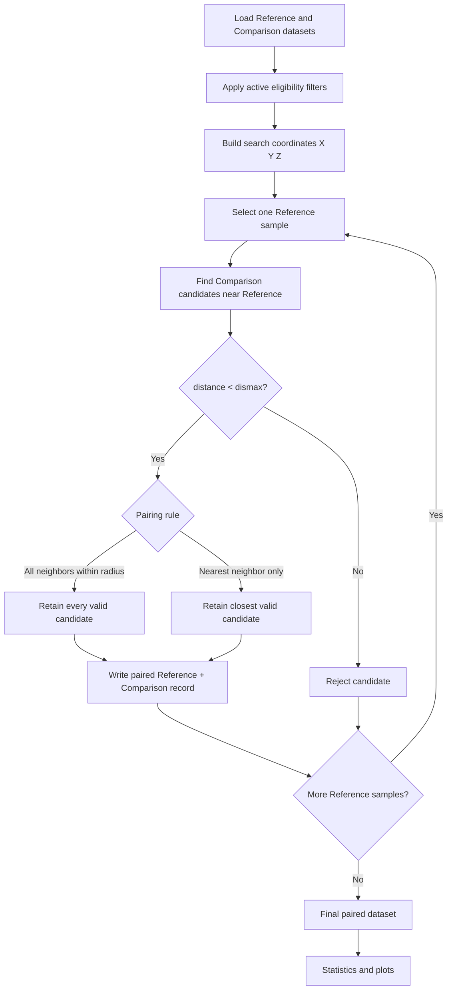

# Technical Note — Pairing Algorithm Based on FORTRAN GETPAIRS

## 1. Purpose

The application performs spatial pairing between two sample datasets using the logic of the FORTRAN **GETPAIRS** program.

The objective is simple:

- **Dataset 1 = Reference**
- **Dataset 2 = Comparison**
- For each reference sample, search Dataset 2 for samples located inside a user-defined maximum distance.
- Retain either all valid neighbors or only the closest neighbor, depending on the selected pairing rule.

The resulting pairs are then used for the statistical comparison.

---

## 2. Core pairing logic

For each reference sample `j`, the algorithm evaluates candidate comparison samples `i`.

The squared separation distance is:

```text
dis = (Xref - Xcmp)^2
    + (Yref - Ycmp)^2
    + (Zref - Zcmp)^2
```

The search threshold is:

```text
dsqd = dismax^2
```

A pair is accepted only when:

```text
dis < dsqd
```

The inequality is **strict**.

Therefore, a comparison sample located exactly at the selected search distance is excluded.

Example:

```text
dismax = 2.0 m

distance = 1.99 m  -> accepted
distance = 2.00 m  -> excluded
distance = 2.01 m  -> excluded
```

---

## 3. Pairing workflow



The reference dataset always drives the search. This means the algorithm is **reference-centered**, not a symmetric nearest-neighbor matching procedure.

---

## 4. Pairing modes

### 4.1 All neighbors within radius

This corresponds to:

```text
ikeepclose = 0
```

Every comparison sample satisfying the strict distance criterion is retained.

Example:

```text
Search radius = 2.0 m

Reference R1
   |
   |-- C1 = 0.8 m  -> retain
   |-- C2 = 1.4 m  -> retain
   |-- C3 = 2.5 m  -> reject
```

Output:

```text
R1 - C1
R1 - C2
```

A single reference sample can therefore generate multiple paired rows.

---

### 4.2 Nearest neighbor only

This corresponds to:

```text
ikeepclose = 1
```

Only the closest comparison sample inside the search radius is retained.

Using the same example:

```text
Reference R1
   |
   |-- C1 = 0.8 m  -> closest
   |-- C2 = 1.4 m
   |-- C3 = 2.5 m  -> outside radius
```

Output:

```text
R1 - C1
```

There is at most one retained comparison sample for each reference sample.

---

## 5. Equal-distance ties

In nearest-neighbor mode, the closest candidate is updated only when a new distance is strictly smaller than the current closest distance.

Conceptually:

```text
if dis < dclose:
    dclose = dis
    keep candidate
```

Because the comparison is `<` rather than `<=`, two candidates at exactly the same minimum distance do not replace one another.

The first comparison record encountered at that minimum distance is retained.

Example:

```text
R1 -> C10 = 1.25 m
R1 -> C11 = 1.25 m
```

Result:

```text
R1 - C10
```

assuming `C10` occurs first in Dataset 2.

---

## 6. Comparison-sample reuse

The method does **not** impose a global one-to-one assignment.

A comparison sample can be paired with more than one reference sample.

Example:

```text
R1 ----        >---- C5
R2 ----/
```

This is valid.

The search is performed independently for each reference sample, so selecting `C5` for `R1` does not remove `C5` from consideration for `R2`.

---

## 7. 3D and 2D search

### 3D search

When X, Y, and Z are active:

```text
dis = dx^2 + dy^2 + dz^2
```

This produces a spherical search neighborhood.

### 2D search

When Z is ignored:

```text
Zref = 0
Zcmp = 0
```

and therefore:

```text
dis = dx^2 + dy^2
```

The search becomes circular in plan view.

The spatial visualization may still display original Z values for geological context, but Z does not contribute to pair acceptance when the 2D option is active.

---

## 8. Eligibility filtering before pairing

The application can reduce the eligible records before the spatial search.

Typical filters include:

```text
Valid assay
Grade range
Categorical variable
```

Examples of categorical variables are lithology, alteration, domain, weathering, drilling campaign, or sample type.

The sequence is:

```text
Input data
   -> eligibility filters
   -> spatial search
   -> paired dataset
   -> statistics
```

Therefore, only samples that pass the active filters are available to become pairs.

---

## 9. Python implementation

A literal nested search between every reference and comparison sample would require approximately:

```text
Nreference × Ncomparison
```

distance evaluations.

The application accelerates candidate identification using:

```text
scipy.spatial.cKDTree
```

The KD-tree is used only to identify nearby candidates efficiently.

The final acceptance logic still applies the GETPAIRS condition explicitly:

```text
distance_squared < dismax^2
```

This preserves the important behavior of the original algorithm while providing much better performance for large datasets.

---

## 10. Final paired dataset

Each accepted pair contains:

```text
Reference record
+
Comparison record
+
Pair separation distance
```

Conceptually:

```text
Reference R1  <---- 1.23 m ---->  Comparison C8
Reference R2  <---- 0.74 m ---->  Comparison C5
Reference R3  <---- 1.91 m ---->  Comparison C5
```

These exact paired records are the population used by the subsequent statistical comparison and spatial pair-location plots.

---

## 11. Algorithm summary

The complete logic can be summarized as:

```text
FOR each Reference sample:

    identify nearby Comparison candidates

    FOR each candidate:

        calculate squared spatial distance

        IF distance_squared < dismax^2:

            IF mode = all neighbors:
                retain candidate

            IF mode = nearest neighbor:
                retain only the closest candidate
                preserve first occurrence in an exact tie

Comparison records remain reusable.

Return the final paired dataset.
```

The key characteristics are therefore:

- reference-driven search;
- strict distance threshold;
- all-neighbor or nearest-neighbor mode;
- first-occurrence tie handling;
- comparison-record reuse;
- optional 2D or 3D search;
- eligibility filtering before pairing;
- KD-tree acceleration without changing the pairing rule.
